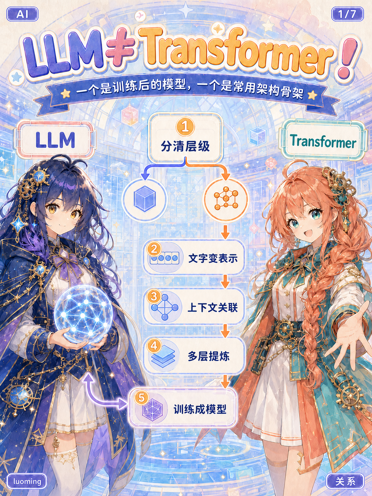
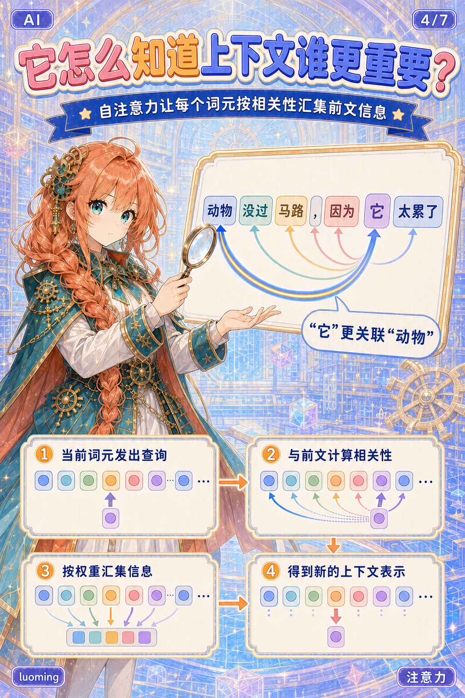
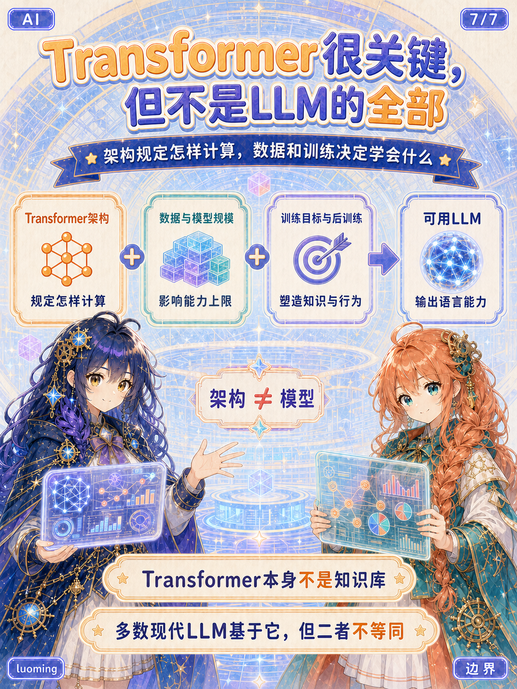
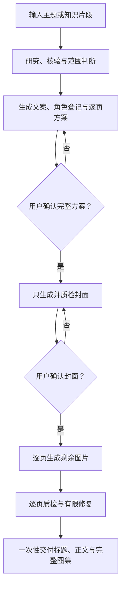
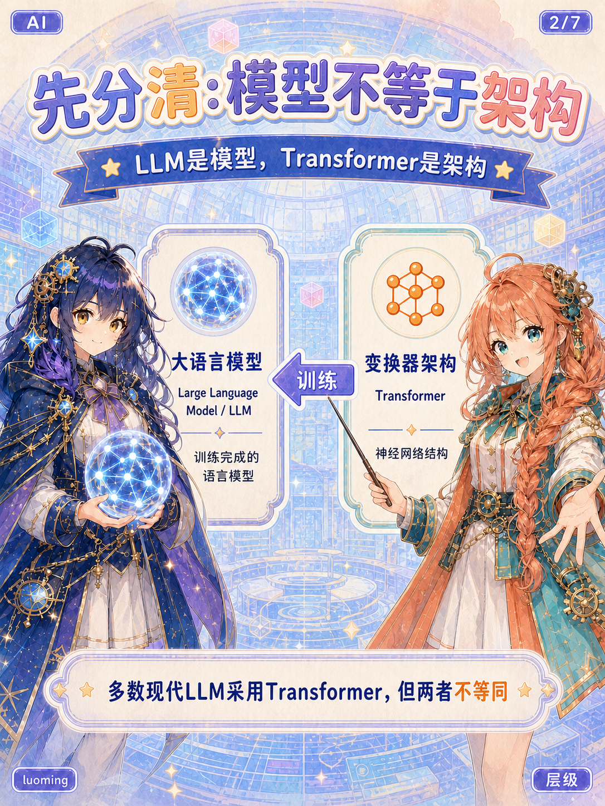
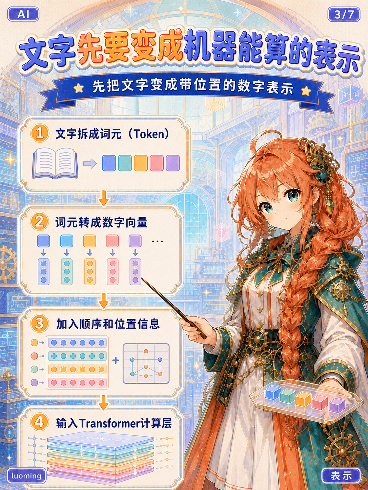
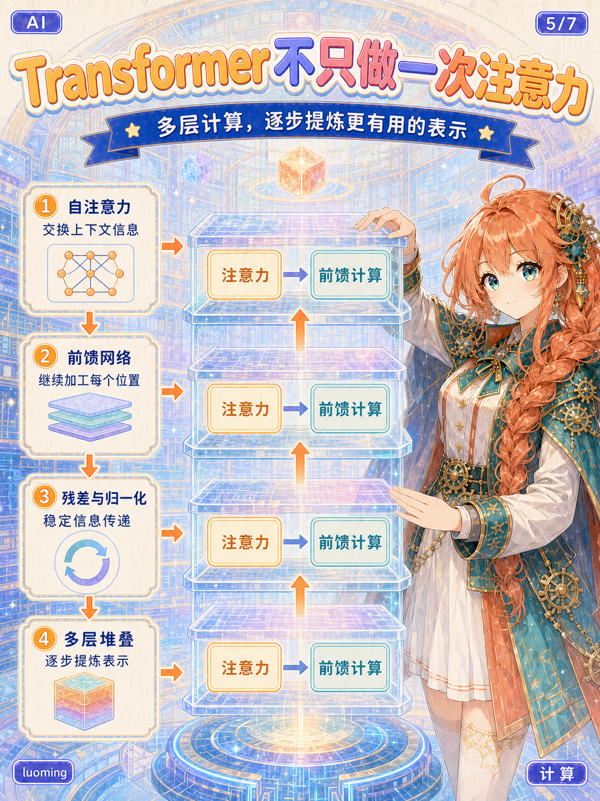
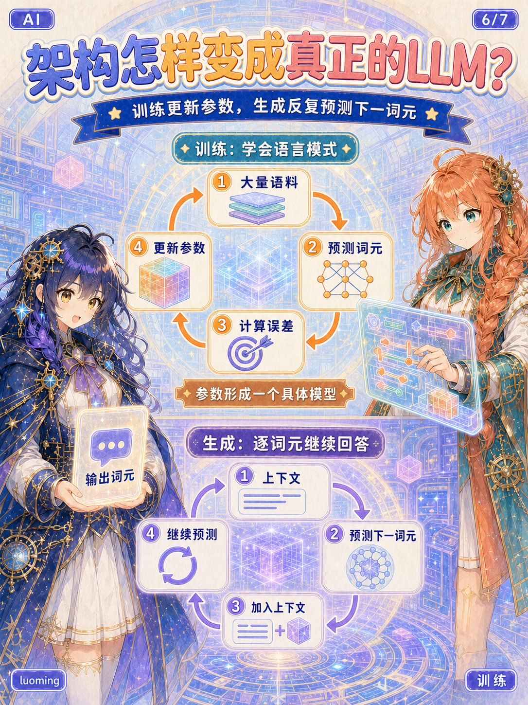

<p align="center">
  
</p>

<h1 align="center">小红书萌娘风格知识图解生成器</h1>

<p align="center">
  <code>create-xhs-moe-notes</code> · 面向 Codex 桌面版的中文内容创作 Skill
</p>

<p align="center">
  <a href="./LICENSE"></a>
  <a href="./ASSET_LICENSE.md"></a>
  <a href="https://github.com/luoming-hu"></a>
</p>

<p align="center">
  <a href="#-快速体验"><strong>快速体验</strong></a>
  ·
  <a href="#-完整安装"><strong>完整安装</strong></a>
  ·
  <a href="#-完整案例"><strong>查看完整案例</strong></a>
</p>

把一个 AI 概念或一段知识材料交给 Codex，这个 Skill 会先研究和规划内容，再完成标题、200字内正文、角色设计、逐页图解方案、两阶段确认、生图质检与中断恢复。它追求的不只是“生成一张好看的图”，而是一套可确认、可连续、可修复的小红书知识图解工作流。

## 目录

- [效果预览](#-效果预览)
- [快速体验](#-快速体验)
- [完整安装](#-完整安装)
- [核心能力](#-核心能力)
- [工作流程](#-工作流程)
- [完整案例](#-完整案例)
- [项目结构](#-项目结构)
- [使用边界](#-使用边界)
- [授权与作者](#-授权与作者)

## ✨ 效果预览

下面三页分别展示封面导航、核心机制讲解与边界总结。点击图片可查看原图。

<table>
  <tr>
    <td align="center" width="33%">
      <a href="./examples/llm-transformer/01-cover.png"></a>
    </td>
    <td align="center" width="33%">
      <a href="./examples/llm-transformer/04-注意力.png"></a>
    </td>
    <td align="center" width="33%">
      <a href="./examples/llm-transformer/07-边界.png"></a>
    </td>
  </tr>
  <tr>
    <td align="center"><strong>1/7 · 关系导航</strong><br>先用封面建立阅读路线</td>
    <td align="center"><strong>4/7 · 核心机制</strong><br>用连线表达上下文关联</td>
    <td align="center"><strong>7/7 · 边界总结</strong><br>让结尾增加新价值</td>
  </tr>
</table>

## 🚀 快速体验

适合第一次尝试，不需要先把 Skill 安装到全局目录。

1. 下载或克隆本仓库，并在 Codex 桌面版中打开仓库文件夹。
2. 新建任务，发送下面的需求：

```text
请读取 skill/create-xhs-moe-notes/SKILL.md，并按其中工作流执行：
现在的 LLM 与 Transformer 是什么关系？Transformer 在其中起到了什么作用？
先给我完整确认稿，不要立即生图。
```

Skill 会先提交完整方案并等待授权，不会直接开始生成图片。

## 📦 完整安装

完整安装后，可以在其他 Codex 项目中直接调用 `$create-xhs-moe-notes`。

### macOS / Linux

```bash
git clone https://github.com/luoming-hu/create-xhs-moe-notes.git
mkdir -p ~/.codex/skills
cp -R create-xhs-moe-notes/skill/create-xhs-moe-notes ~/.codex/skills/
```

### Windows PowerShell

```powershell
git clone https://github.com/luoming-hu/create-xhs-moe-notes.git
New-Item -ItemType Directory -Force "$HOME\.codex\skills" | Out-Null
Copy-Item -Recurse ".\create-xhs-moe-notes\skill\create-xhs-moe-notes" "$HOME\.codex\skills\create-xhs-moe-notes"
```

安装后重新打开 Codex，或新建一个任务，然后发送：

```text
使用 $create-xhs-moe-notes 把一个 AI 概念制作成小红书萌娘知识图解，
先给我完整确认稿，不要立即生图。
```

> [!TIP]
> 真正需要安装的是 `skill/create-xhs-moe-notes/`，不是整个仓库根目录。

## 🧩 核心能力

| 能力 | 作用 |
|---|---|
| 🔎 研究与核验 | 对概念进行联网研究，优先使用官方文档、论文和一手资料 |
| ✍️ 小红书文案 | 生成1个推荐标题、2个备选标题，以及含标签的200字内正文 |
| 🧭 讲解框架 | 根据主题选择关系、机制、对比、诊断或决策等图解结构 |
| 🎭 角色连续性 | 登记脸型、眼睛、发型、服装、配色、道具和身份框状态 |
| 🖼️ 系列图规划 | 默认规划4—8张3:4竖图，让每一页只承担一个核心结论 |
| ✅ 视觉质检 | 检查中文、手部、人物文字禁区、逻辑连线、角标和跨页一致性 |
| 🔧 有限自动修复 | 只修复不合格页面，每页最多自动修复2次，不重做合格页面 |
| ♻️ 中断恢复 | 保留已经合格的图片，恢复后只补齐缺失或不合格页面 |

## 🛠️ 工作流程



两次确认分别保护不同内容：

1. **方案确认**：锁定知识范围、文案、角色和分页结构。
2. **封面确认**：锁定全套图片的角色标准与视觉方向。

确认封面后，剩余页面会按页码连续生成和质检，不再要求逐页确认。

## 🖼️ 完整案例

测试主题：**现在的 LLM 与 Transformer 是什么关系？Transformer 在其中起到了什么作用？**

<table>
  <tr>
    <td align="center"><a href="./examples/llm-transformer/01-cover.png"></a><br><strong>1/7 关系</strong></td>
    <td align="center"><a href="./examples/llm-transformer/02-层级.png"></a><br><strong>2/7 层级</strong></td>
    <td align="center"><a href="./examples/llm-transformer/03-表示.png"></a><br><strong>3/7 表示</strong></td>
    <td align="center"><a href="./examples/llm-transformer/04-注意力.png"></a><br><strong>4/7 注意力</strong></td>
  </tr>
  <tr>
    <td align="center"><a href="./examples/llm-transformer/05-计算.png"></a><br><strong>5/7 计算</strong></td>
    <td align="center"><a href="./examples/llm-transformer/06-训练.png"></a><br><strong>6/7 训练</strong></td>
    <td align="center"><a href="./examples/llm-transformer/07-边界.png"></a><br><strong>7/7 边界</strong></td>
    <td align="center"><strong>完整故事线</strong><br><br>关系<br>↓<br>表示<br>↓<br>注意力<br>↓<br>计算<br>↓<br>训练<br>↓<br>边界</td>
  </tr>
</table>

## 📁 项目结构

```text
create-xhs-moe-notes/
├── README.md
├── LICENSE
├── ASSET_LICENSE.md
├── assets/
│   └── readme/                  # README 横幅及可编辑源文件
├── examples/
│   └── llm-transformer/         # 七页完整示例
└── skill/
    └── create-xhs-moe-notes/    # 可直接安装的纯 Skill
        ├── SKILL.md
        ├── agents/
        │   └── openai.yaml
        ├── references/
        ├── assets/
        └── scripts/
```

Skill 的详细规则采用渐进式披露：核心流程位于 [`SKILL.md`](./skill/create-xhs-moe-notes/SKILL.md)，研究、故事框架、视觉系统和质量标准按需从 [`references/`](./skill/create-xhs-moe-notes/references/) 读取。

## ⚠️ 使用边界

- 当前版本主要针对 AI 概念和用户提供的知识片段进行调优。
- 联网研究取决于当前环境是否具备可用网络和检索能力。
- 实际生图需要当前 Codex 任务中已经提供图像生成能力。
- 中文排版、人物手部和跨页一致性仍需要逐张视觉检查。
- 每个问题页最多自动修复2次；连续失败时会停止并保留合格结果。
- Skill 不会把“继续”“可以”等模糊表达自动当作生图授权。
- 生图耗时取决于模型服务、参考图数量、页面复杂度和修复次数。

## 📄 授权与作者

- Skill、说明文档和脚本使用 [MIT License](./LICENSE)。
- 风格参考图等运行素材使用单独的[视觉素材许可](./ASSET_LICENSE.md)：允许随 Skill 使用，但不得单独转载、打包或出售。
- `examples/` 中的示例成品以及 README 品牌视觉：**Copyright © luoming. All Rights Reserved.**

作者：[`luoming`](https://github.com/luoming-hu)

欢迎通过 Issue 反馈使用问题或提出改进建议。提交 Pull Request 时，请勿加入无明确授权的图片、字体或其他第三方素材。
